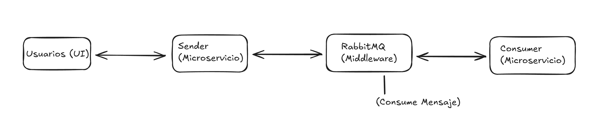

# Proyecto de Microservicios utilizando RabbitMQ

Este proyecto implementa una arquitectura de microservicios donde múltiples aplicaciones **sender** envían peticiones a una 
cola de mensajes en **RabbitMQ**, y múltiples aplicaciones **consumer** leen y procesan estas peticiones.

El objetivo de este sistema es permitir la transmisión asíncrona de mensajes entre servicios utilizando **RabbitMQ** 
como un intermediario para asegurar la correcta entrega y procesamiento de las peticiones.

## Componentes del Sistema
- **Sender**: Aplicación que genera y envía mensajes a la cola de **RabbitMQ**.
- **Consumer**: Aplicacón que consume los mensajes de la cola de **RabbitMQ** y realiza las tareas necesarias.
- **RabbbitMQ**: Servidor de mensajería que actúa como intermediario entre los **Senders** y los **Consumers**.

## Flujo de trabajo
1. **Sender** recibe las peticiones.
2. **Sender** envia las peticiones a **RabbitMQ**.
3. **Consumer** consume los mensajes de la cola y procesa las peticiones.
4. **Resultado** el consumidor puede almacenar los resultado, enviar notificaciones, o realizar otras acciones según el caso.

## Arquitectura

La arquitectura del sistema sigue un patrón **Producer-Consumer** utilizando **RabbitMQ** como middleware. Los componentes principales son:

- **Senders**: Servicios que envían mensajes a RabbitMQ. Estos servicios suelen recibir datos a través de un formulario web o API y, a continuación, formatean el mensaje en formato JSON y lo envían a una cola de RabbitMQ.
  
- **RabbitMQ**: Gestiona las colas de mensajes donde los mensajes enviados por los **senders** se almacenan temporalmente antes de ser consumidos por los **consumers**.

- **Consumers**: Servicios que consumen los mensajes de la cola y los procesan. Pueden realizar tareas como almacenar datos en una base de datos, enviar correos electrónicos, procesar pagos, entre otros.

## Diagrama de la arquitectura


1. El **Usuario** genera un mensaje con una acción.
2. El **sender** publica el mensaje en la cola de RabbitMQ.
3. **RabbitMQ** almacena en colas los mensajes enviados por los **senders**
4. El **consumer** lee el mensaje desde la cola y lo procesa.

### Comunicación entre microservicios

- Los **senders** y **consumers** se comunican a través de **RabbitMQ** mediante el uso de colas y exchanges.
- Los mensajes son enviados en formato **JSON** para asegurar la interoperabilidad.
- Los **senders** publican mensajes en una asignada a cada proceso, si esta dedicado al envio de sms, el sender publicará el mensaje en una cola llamada cola_sms
- Los **consumers** se suscriben a esta cola y procesan los mensajes en orden.

## Configuración de RabbitMQ

- **RabbitMQ** está configurado para ser tolerante a fallos con colas durables.
- Las colas están configuradas con "acknowledgement" para garantizar que los mensajes solo se marcan como procesados una vez que se han completado.

## Sender

El servicio **sender** es responsable de recibir peticiones y enviarlas a RabbitMQ. A continuación se describe cómo funciona:

### Flujo de un Sender

1. El sender recibe una petición (por ejemplo, a través de una API REST o una interfaz de usuario).
2. El sender formatea los datos en formato **JSON**.
3. El sender se conecta a RabbitMQ y envía el mensaje a la cola `cola_peticiones`.
4. Si el envío es exitoso, el sender devuelve una respuesta de éxito.

### Ejemplo de código del Sender (PHP)

```php
require 'vendor/autoload.php';

use PhpAmqpLib\Connection\AMQPStreamConnection;
use PhpAmqpLib\Message\AMQPMessage;
use Ramsey\Uuid\Uuid; 
date_default_timezone_set('Europe/Madrid');

if ($_SERVER['REQUEST_METHOD'] == 'POST') {
    $mensaje = $_POST['mensaje'] ?? 'Mensaje Vacío';
    $telefono = $_POST['telefono'] ?? 'Teléfono Vacío';
    $timestamp = date('Y-m-d H:i:s');
    $mensaje_id = Uuid::uuid4()->toString();

    // Datos del mensaje principal
    $data = [
        'id' => $mensaje_id,
        'mensaje' => $mensaje,
        'telefono' => $telefono,
        'fecha' => $timestamp 
    ];

    $json_data = json_encode($data);

    // Conectar con RabbitMQ
    $connection = new AMQPStreamConnection('rabbitmq', 5672, 'tu_usuario', 'tu_password');
    $channel = $connection->channel();

    // Declarar la cola de SMS como durable para que persista
    $channel->queue_declare('cola_sms', false, true, false, false);

    // Declarar la cola de logs como durable
    $channel->queue_declare('logs', false, true, false, false);

    // Enviar mensaje a la cola de SMS (sin persistencia)
    $msg = new AMQPMessage($json_data);
    $channel->basic_publish($msg, '', 'cola_sms');

    $cuerpo = 'Petición enviada por un sender';
    
    // Datos del log
    $log_data = [
        'id' => $mensaje_id,
        'mensaje' => $mensaje,
        'telefono' => $telefono,
        'fecha' => $timestamp,
        'cuerpo' => $cuerpo
    ];

    $json_data_log = json_encode($log_data);

    // Enviar mensaje a la cola de logs (sin persistencia)
    $msglog = new AMQPMessage($json_data_log);
    $channel->basic_publish($msglog, '', 'logs');

    // Cerrar conexión
    $channel->close();
    $connection->close();

    echo 'Mensaje enviado: ' . htmlspecialchars($json_data); 
} else {
    echo 'Método no permitido';
}

```
## Consumer
El servicio **consumer** es responsble de leer las peticiones almacenadas en la cola de **RabbitMQ** y procesarlas. A continuación se describe cómo funciona:

## Flujo de un Consumer

1. El consumer se conecta al servidor de mensajeria (**RabbitMQ**).
2. Una vez se ha conectado exitosamente abre un canal lógico sobre la conexión. Es el canal por el cual se comunican cliente y broker.
3. El **consumer** se "engancha" a una cola (**queue**) específica desde la que quiere recibir mensaje. Si esta no existe puede crearla (según configuración).
4. El **consumer** se pone en modo "escucha", esperando a que lleguen los mensajes a esa cola. Estos mensajes pueden ser:
- Leídos uno a uno (con **ACK** manual o automático).
- Procesados de forma asíncrona.
5. Cuando recibe un mensaje, ejecuta el codigo necesario para procesarlo: por ejemplo, guardar en base de datos, enviar un email, hacer una llamada API, etc.
6. Informa al broker que el mensaje fue procesado correctamente. Si no lo hace (por error o crash), el mensaje puede reenviarse o redirigirse (depende de la política configurada).

### Ejemplo de código del Consumer (PHP)
```php
require 'vendor/autoload.php';

use PhpAmqpLib\Connection\AMQPStreamConnection;
use PhpAmqpLib\Message\AMQPMessage;

date_default_timezone_set('Europe/Madrid');

// Conectar a RabbitMQ
$connection = new AMQPStreamConnection('rabbitmq', 5672, 'admin', 'admin');
$channel = $connection->channel();

// Declarar la cola de SMS y la cola de logs como durables (persistentes)
$channel->queue_declare('cola_sms', false, true, false, false);
$channel->queue_declare('logs', false, true, false, false);

$mensajes = "";
$log_data = [];

while ($msg = $channel->basic_get('cola_sms')) {
    if ($msg) {
        $data = json_decode($msg->body, true);

        // Mostrar los mensajes consumidos
        $mensajes .= "📩 <strong>ID:</strong> {$data['id']} <br>";
        $mensajes .= "✉️ <strong>Mensaje:</strong> {$data['mensaje']} <br>";
        $mensajes .= "📞 <strong>Teléfono:</strong> {$data['telefono']} <br>";
        $mensajes .= "⏳ <strong>Fecha:</strong> {$data['fecha']} <br><hr>";
        
        // Acknowledge el mensaje para confirmar que ha sido procesado
        $msg->ack();
        
        // Registrar el consumo del mensaje en la cola de logs
        $timestamp = date('Y-m-d H:i:s');
        $log_data = [
            'id' => $data['id'],
            'mensaje' => $data['mensaje'],
            'telefono' => $data['telefono'],
            'fecha' => $timestamp,
            'cuerpo' => 'Registro consumido por un consumidor',
            'fecha_consumo' => $timestamp
        ];

        // Crear el mensaje de log y enviarlo a la cola de logs (sin persistencia)
        $json_log_data = json_encode($log_data);
        $msg_log = new AMQPMessage($json_log_data);
        $channel->basic_publish($msg_log, '', 'logs');
    }
}

// Cerrar la conexión
$channel->close();
$connection->close();

// Mostrar los mensajes consumidos
echo $mensajes ?: "<p>No hay mensajes en la cola.</p>";
?>
```
## Formato de JSON
### Formato JSON envío mensaje a cola RabbitMQ
```
object		{4}
id: 22c578ff-29d7-4941-80e3-d75a46d8548f
mensaje	: Prueba
telefono : 1234567890
fecha : 2025-04-04 12:57:07

```
## Autentificación mediante Token Bearer


## Despliegue
1. git clone https://github.com/marcosriveraa/EstructuraMicroservicios.git
2. Ejecutamos en nuestra máquina **docker compose build**
3. Ejecutamos en nuestra máquina **docker compose up -d**

## Puertos despliegue herramientas
1. **9890**: Puerto de acceso al panel de administración de **RabbitMQ**.
2. **3000**: Puerto de acceso al panel de **Grafana**.
3. **9090**: Puerto de acceso al panel de **Prometheus**.
